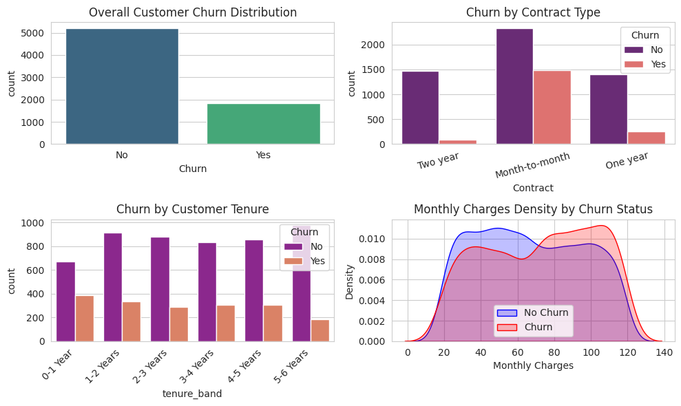
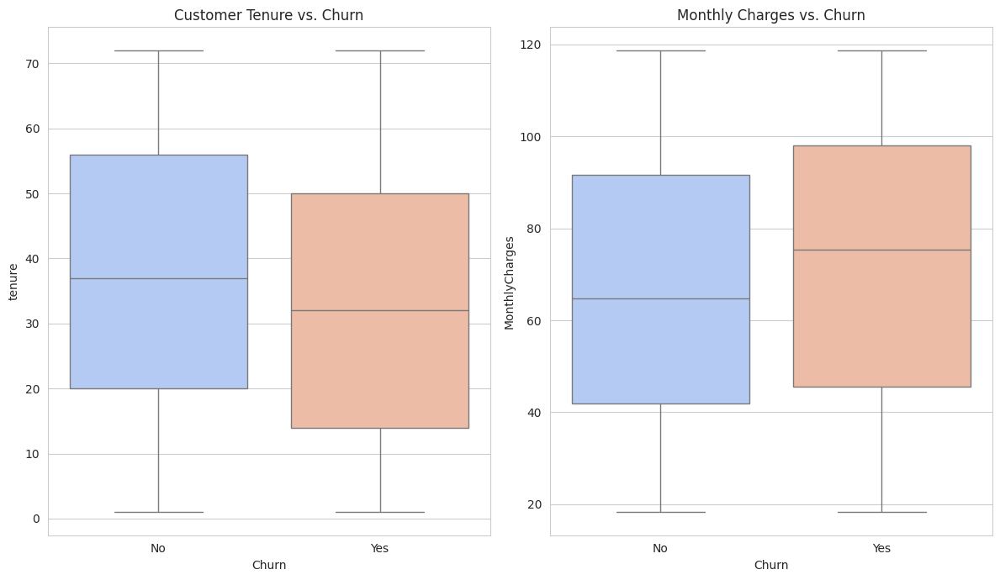
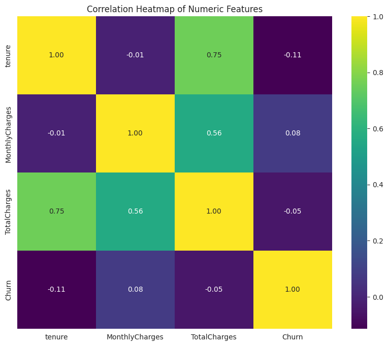

# 📊 Customer Churn Analysis | Data Analytics Project (Python)

Analyze telecom customer churn using Python, feature engineering, and data visualization to uncover the key factors that influence customer retention.

---

## 📌 Project Overview

Customer churn is a major challenge for subscription-based businesses. This project analyzes telecom customer behavior to identify churn patterns and generate actionable business insights.

The project uses a synthetic dataset with characteristics similar to the popular Telco Customer Churn dataset, allowing the analysis to run without requiring an external dataset.

---

## 🎯 Objectives

- Analyze customer churn patterns
- Identify high-risk customers
- Perform feature engineering for better customer segmentation
- Generate meaningful business insights
- Visualize customer behavior using Python

---

## 🛠️ Tech Stack

- Python
- Pandas
- NumPy
- Matplotlib
- Seaborn
- Jupyter Notebook

---

## 📂 Project Structure

```text
Customer-Churn-Analysis/
│
├── Customer_Churn_Analysis.ipynb
├── README.md
├── requirements.txt
│
└── images/
    ├── churn_dashboard.png
    ├── churn_boxplots.png
    └── correlation_heatmap.png
```

---

## ⚙️ Features

- Generates a synthetic telecom customer dataset
- Performs feature engineering using customer tenure bands
- Analyzes customer churn patterns
- Identifies high-risk customer segments
- Creates multiple data visualizations
- Saves charts automatically as PNG files

---

## 📈 Visualizations

The notebook generates the following visualizations:

- Customer Churn Distribution
- Churn by Contract Type
- Churn by Customer Tenure
- Monthly Charges Density by Churn Status
- Customer Tenure vs. Churn (Box Plot)
- Monthly Charges vs. Churn (Box Plot)
- Correlation Heatmap

---

## 🔍 Key Insights

- Customers with **Month-to-Month** contracts have the highest churn rate.
- Customers with shorter tenure are more likely to churn.
- Long-term contracts significantly improve customer retention.
- Higher monthly charges are associated with an increased likelihood of churn.

---

## ▶️ Getting Started

### Install Dependencies

```bash
pip install pandas numpy matplotlib seaborn
```

### Run the Notebook

Open **'Customer_Churn_Analysis.ipynb'** in Jupyter Notebook or JupyterLab and run all cells.

The notebook will:

- Generate synthetic telecom customer data
- Perform feature engineering
- Analyze churn patterns
- Generate visualizations
- Save the charts as PNG files

---

## 📊 Sample Outputs

### Customer Churn Dashboard



### Churn Boxplot Analysis



### Feature Correlation Heatmap



---

## 🚀 Future Improvements

- Develop a machine learning model for churn prediction
- Build an interactive Power BI dashboard
- Create a Streamlit web application
- Analyze Customer Lifetime Value (CLV)
- Integrate real-world telecom datasets

---

## 📜 License

This project is intended for learning and portfolio purposes.

---

⭐ **If you found this project useful, feel free to fork or star this repository!**
